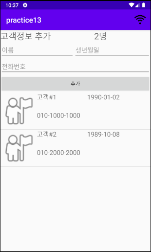

# Practice13 RecyclerVIew에 고객정보 추가하기

* [ViewCode](app/src/main/java/com/example/practice13/MainActivity.java)
* Function
  * 추가버튼을 누르면 고객 수 추가(``adapter`` and ``inflater``)
    * 생년월일 -> ``DatePickerDIalog``
    * 전화번호 -> ``PhoneNumberUtils.formatNumber(phone)`` 로  010-0000-0000형태로 변환
  * ``listView`` 클릭 -> ``AlertDialog``로 삭제 여부 확인
  * ``actionBar`` 와이파이 아이콘 -> 와이파이 상태를 나타냄
*  실행화면
  * 

