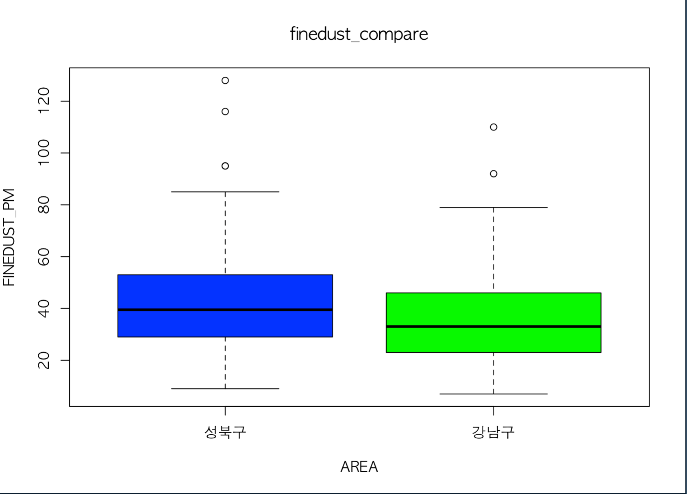

# project01 치킨집이 가장 많은 지역 찾기

* 실행결과
  * 트리맵을 활용한 서대문구 치킨집 분포
  * 
* 활용 데이터
  * [LOCALDATA](http://www.localdata.kr/)

# project02 지역별 미세먼지 농도 비교하기

* 실행결과

  * 성북구와 강남구의 미세먼지 비교 및 지역별 차이 검정

  * 

  * ```R
    > t.test(data = dustdata_anal, finedust ~ area, var.equal=T)
    
    	Two Sample t-test
    
    data:  finedust by area
    t = -2.943, df = 242, p-value = 0.003567
    alternative hypothesis: true difference in means is not equal to 0
    95 percent confidence interval:
     -11.79476  -2.33639
    sample estimates:
    mean in group 강남구 mean in group 성북구 
                35.68033             42.74590 
    ```

* 활용 데이터

  * [서울특별시 대기환경 정보](https://cleanair.seoul.go.kr/2020/statistics/periodAverage)

# project04 지하철 역 주변 아파트 가격 알아보기

* 사용 라이브러리

  * Dplyr, devtools, ggmap
    * install_github("doable/ggmap")

* 실행결과

  * 삼성역 주변 85평 아파트 가격

  

* 활용 데이터

  * [지하철역 주소 정보: 서울열린데이터광장](https://data.seoul.go.kr/)
  * [국토교통부 실거래가 공개 시스템](http://rtdown.molit.go.kr/)
  * [Google Maps Platform](https://cloud.google.com/maps-platform/)

