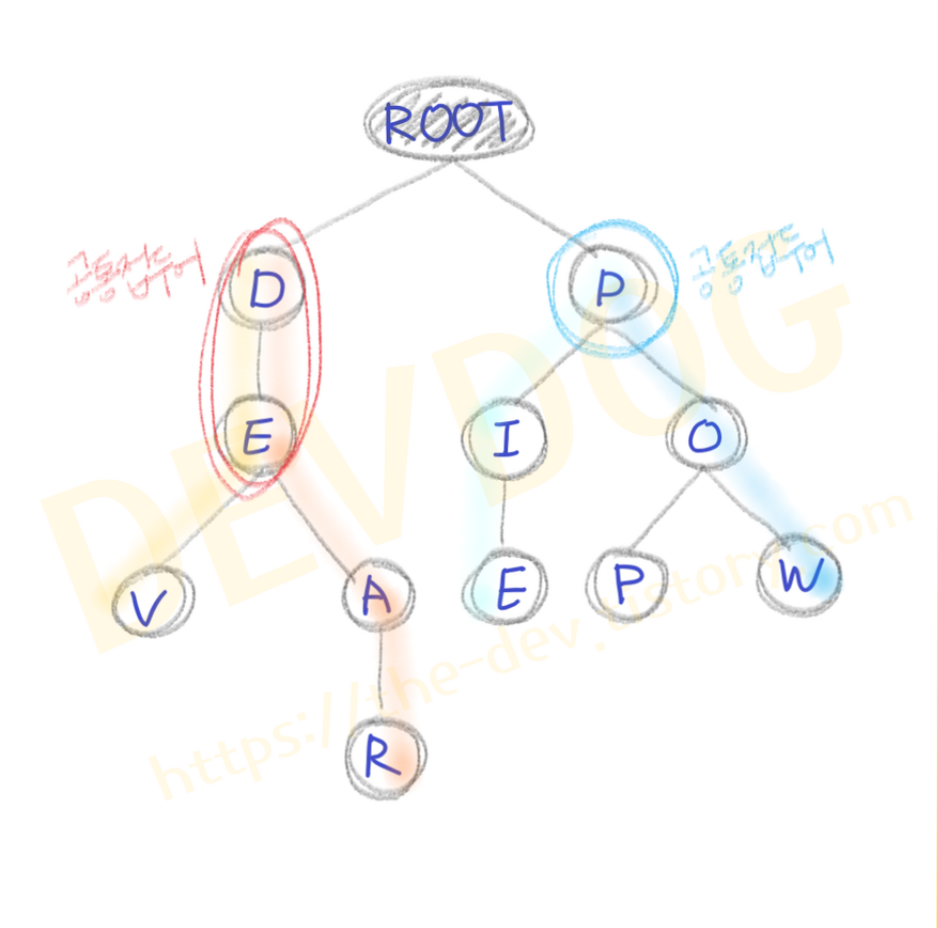

[출처](https://the-dev.tistory.com/2)

# TRIE 

## trie자료구조

* 트리 자료구조 중 하나
* 텍스트 자동완성기능과 같이 문자열을 저장하고 탐색하는데 유용한 자료구조
* 각 노드는 ```<key, value>``` 맵을 가지고 있음
  * ```key``` 는 하나의 알파벳
  * ``value`` 는 key의 자식노드
*  

## 구현하기

### 클래스 생성

* ``TrieNode.java``

  ```java
  public class TrieNode {
  	// [ 변수 ]
  	// 자식 노드 맵
  	private Map<Character, TrieNode> childNodes = new HashMap<>();
  	private boolean isLastChar;	// 마지막 글자인지 여부
    
  	// [ GETTER / SETTER 메서드 ]
  	// 자식 노드 맵 Getter
  	Map<Character, TrieNode> getChildNodes() {
  		return this.childNodes;
  	}
  	
    // 마지막 글자인지 여부 Getter
  	boolean isLastChar() {
  		return this.isLastChar;
  	}
  	
    // 마지막 글자인지 여부 Setter
  	void setIsLastChar(boolean isLastChar) {
  		this.isLastChar = isLastChar;
  	}
  }
  ```

  * ``TrieNode`` 는 자식노드맵과 현재노드가 마지막인지 여부에 대한 정보를 가지고 있음
  
* Trie.java

  * ```java
    public class Trie {
    	// [ 변수 ]
    	// 루트 노드
    	private TrieNode rootNode;
    
      Trie() {
    		rootNode = new TrieNode();
    	}
      // [ 메서드 ]
      // 자식 노드 추가
    	void insert(String word) {
    		TrieNode thisNode = this.rootNode;
    		for (int i = 0; i < word.length(); i++) {
    			thisNode = thisNode.getChildNodes().computeIfAbsent(word.charAt(i), c -> new TrieNode());
    		}
    		thisNode.setIsLastChar(true);
    	}
    	
      // 특정 단어가 들어있는지 확인
    	boolean contains(String word) {
    		TrieNode thisNode = this.rootNode;
    		for (int i = 0; i < word.length(); i++) {
    			char character = word.charAt(i);
    			TrieNode node = thisNode.getChildNodes().get(character);
    			if (node == null)
    				return false;
    			thisNode = node;
    		}
    		return thisNode.isLastChar();
    	}
      
    	// 특정 단어 지우기
    	void delete(String word) {
    		delete(this.rootNode, word, 0); // 최초로 delete 던지는 부분
    	}
    	
      private void delete(TrieNode thisNode, String word, int index) {
    		char character = word.charAt(index);
    		// APPLE, PEN과 같이 아예 없는 단어인 경우 에러 출력
    		if(!thisNode.getChildNodes().containsKey(character))
    			throw new Error("There is no [" + word + "] in this Trie.");
    		TrieNode childNode = thisNode.getChildNodes().get(character);
    		index++;
    		if(index == word.length()) {
    			// 삭제조건 2번 항목
    			// PO와 같이 노드는 존재하지만 insert한 단어가 아닌 경우 에러 출력
    			if (!childNode.isLastChar())
    				throw new Error("There is no [" + word + "] in this Trie.");
    			childNode.setIsLastChar(false);
    			// 삭제조건 1번 항목
    			// 삭제 대상 언어의 제일 끝으로써 자식 노드가 없으면(이 단어를 포함하는 더 긴 단어가 없으면) 삭제 시작
    			if (childNode.getChildNodes().isEmpty())
    				thisNode.getChildNodes().remove(character);
    			}else {
    				delete(childNode, word, index); // 콜백함수부분
    				// 삭제조건 1,3번 항목
    				// 삭제 중, 자식 노드가 없고 현재 노드로 끝나는 다른 단어가 없는 경우 이 노드 삭제
    				if(!childNode.isLastChar() && childNode.getChildNodes().isEmpty())
    					thisNode.getChildNodes().remove(character);
    			}
    		}
    	}
    
    출처: https://the-dev.tistory.com/3 [DevLogs]
    ```

  * 

 