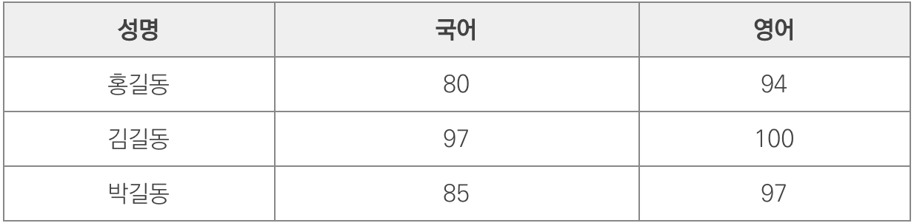
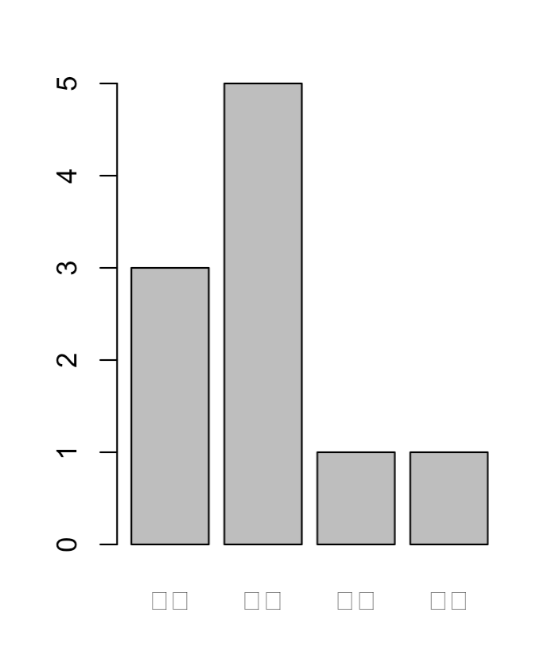

https://thebook.io/006723/

# Ch01.R과 R studio

## 01.R이란

### 빅데이터와 R

3V(Volume, Velocity, Variety)

### R의 장점과 단점

* 장점
  * 통계 분석에 활용할 수 있는 패키지가 많음
  * 커뮤니티
    * https://www.r-tutor.com
    * https://www.r-bloggers.com
  * 무료 / 환경구축 편함 / 다양한 운영체제 지원 / 한글처리
* 단점
  * 느린 속도
  * 대규모  IT서비스 개발에 접목하기 어려움

### R studio

File -> NewFile -> R Script

```R
x <- 10
y <- x * 100
y
# command+Enter로 line별 실행
```

# ch02.데이터 분석과 구조

## 01.데이터 분석 과정 알아보기

### 데이터 분석의 흐름 파악하기


* 데이터 분석 설계
  1. 주제 선정
  2. 가설 설정
  3. 분석 가능 변수 구성
  4. 분석 항목 설정
* 데이터 준비
* 데이터 가공 및 통합
* 데이터 분석
  * 그래프를 그려보며 시각화
* 결론 도출

## 02.데이터의 생김새와 변수와 함수

### 변수 알고 가기

* 변수 만들기

  ```R
  > x <- 10
  # c: combine
  > x1 <- c(10, 20, 30)				# 숫자 3개로 구성된 x1변수 생성
  > x2 <- c(10:15)						# 10~15의 연속된 숫자로 구성
  > x3 <- seq(10, 15)					# 10~15의 연속된 숫자로 구성
  > x4 <- seq(1, 10, by = 4)	# 1~10에서 4 간격
  ```

* =와 <- 차이

  =는 최상위 수준애서만 사용 / <- 어디서든 사용 가능

  ```bash
  > mean(x <- c(1, 2, 3))
  [1] 2
  > x
  [1] 1 2 3
    
  > mean(x = c(1, 2, 3))
  [1] 2
  > x
  Error: object 'x' not found  
  ```

### 함수와 패키지 알고 가기

* 패키지 설치

	```R
	> install.packages("randomForest")
	==================================================
	The downloaded binary packages are in
		/var/folders/jj/825zvqy9595grhqb41gb7b2c0000gn/T//RtmpWRkJmZ/downloaded_packages
	> library(randomForest)
	```

# ch03.데이터 종류

## 01. 스칼라(scalar)

* 단일 차원의 값 ex) 1, 2, 3 /길이가 1인 벡터
* 숫자 / 문자열 / 진리값

### NA

* 데이터 값이 없음 (초기화 되어있음)

```R
> is.na(x)		#(x == NA ? true : false)
```

### NULL

* 초기화가 되지 않은 상태

  ```bash
  > is.null(x)
  > is_even <- NULL
  > if (a 가 짝수면) {
       is_even <- TRUE
    } else {
       is_even <- FALSE
    }
  ```

### 팩터(Factor)

```R
factor(
   X,       # 팩터로 표현하고자 하는 값(주로 문자열 벡터로 지정)
   levels,  # 값의 레벨
   ordered  # TRUE면 순서형, FALSE면 명목형 데이터를 뜻한다. 기본값은 FALSE>다.
)
nlevels(x)		# 레벨의 개수를 반환
levels(x)			# 레벨의 목록을 반환
is.factor(x)	# 주어진 값이 팩터인지를 판단
ordered(x)		# 순서형 팩터를 생성
is.ordered(x)	# 순서형 팩터인지를 판단
```

```R
> sex <- factor("m", c("m", "f"))
> sex
[1] m
Levels: m f
> nlevels(sex)
[1] 2
> levels(sex)
[1] "m" "f"
> levels(sex)[1]		# 1부터
[1] "m"
> levels(sex) <- c("male", "female")
> sex
[1] male
Levels: male female

> ordered("a", c("a", "b", "c"))
[1] a
Levels: a < b < c
```

## 02. 벡터(Vector)

> 한가지 스칼라 데이터 타입의 데이터를 저장
>
> R의 벡터는 Slice를 제공
> Slice: 배열의 일부를 잘라낸 뒤 이를 또 배열처럼 다루는 개념
>
> 각 셀에는 이름을 부여할 수 있다.

### 벡터 생성

* 벡터 중첩 불가능 -> 단일차원으로

  ```R
  > c(1, 2, 3)
  [1] 1 2 3
  > c(1, 2, 3, c(1, 2, 3))
  [1] 1 2 3 1 2 3
  ```

* Names()

  ```R
  > x <- c(1, 3, 4)
  > names (x) <- c("kim", "seo", "park")
  # names()는 값을 얻어오는 함수고, names<-()는 값을 할당하는 함수
  > x
  kim seo park
  1 3 4
  ```

* 색인

  ```R
  > x <- c("a", "b", "c")
  # x[n]
  > x[-1]
  [1] "b" "c"
  > x[-2]
  [1] "a" "c"
  > x[c(1, 3)]
  [1] "a" "c"
  # start:end
  > x[1:2]
  [1] "a" "b"
  > x[1:3]
  [1] "a" "b" "c"
  ```

* 벡터 + index

  ```R
  > x <- c(1, 3, 4)
  > names (x) <- c("kim", "seo", "park")
  > x
  kim seo park
  1 3 4
  > x["seo"]
  seo
  3
  > x[c("seo", "park")]
  seo park
  3 4
  > names(x) [2]
  [1] "seo"
  ```

* 벡터의 길이

  ```R
  > x <- c("a", "b", "c")
  > length(x)
  [1] 3
  > nrow(x)  # nrow()는 행렬만 가능
  NULL
  > NROW(x)  # NROW()는 벡터와 행렬 모두 사용 가능
  [1] 3
  ```

### 벡터 연산

* Identical(): 같은 값을 담고 있는지

  ```R
  > identical(c(1, 2, 3), c(1, 2, 3))
  [1] TRUE
  > identical(c(1, 2, 3), c(1, 2, 100))
  [1] FALSE
  ```

* %in%: 벡터에 포함되어 있는지

  ```R
  > "a" %in% c("a", "b", "c")
  [1] TRUE
  > "d" %in% c("a", "b", "c")
  [1] FALSE
  ```

* 전체 연산

  ```R
  > x <- c(1, 2, 3, 4, 5)
  > x + 1
  [1] 2 3 4 5 6
  > 10 - x
  [1] 9 8 7 6 5
  ```

* == !=

  ```R
  > c(1, 2, 3) == c(1, 2, 100)
  [1] TRUE TRUE FALSE
  > c(1, 2, 3) != c(1, 2, 100)
  [1] FALSE FALSE TRUE
  ```

* union, intersect, setdiff

  ```R
  > union (c("a", "b", "c"), c("a", "d"))      # 합집합 
  [1] "a" "b" "c" "d"
  > intersect (c("a", "b", "c"), c("a", "d"))  # 교집합
  [1] "a"
  > setdiff (c("a", "b", "c"), c("a", "d"))    # 차집합
  [1] "b" "c"
  ```

* setequal(): 집합간 비교

  ```R
  > setequal (c("a", "b", "c"), c("a", "d"))
  [1] FALSE
  > setequal (c("a", "b", "c"), c("a", "b", "c", "c"))
  [1] TRUE
  ```

### 연속된 숫자로 구성된 벡터

* from: end

  ```R
  > seq(3, 7)     # 1씩 증가
  [1] 3 4 5 6 7
  > seq(7, 3)     # 1씩 감소
  [1] 7 6 5 4 3
  > seq(3, 7, 2)  # 2씩 증가
  [1] 3 5 7
  > seq(3, 7, 3)  # 3씩 증가
  [1] 3 6
  
  > x <- c(2, 4, 6, 8, 10)
  > 1:NROW(x)
  [1] 1 2 3 4 5
  > seq_along(x)
  [1] 1 2 3 4 5
  ```

### 반복된 값을 저장하는 벡터

* Rep()

  ```R
  > rep(1:2, times=5)			(1, 2)가 5번 반복
  [1] 1 2 1 2 1 2 1 2 1 2
  ```

* Each / times

  ```R
  > rep(1:2, each=5)
  [1] 1 1 1 1 1 2 2 2 2 2
  > rep(1:2, each=5, times=2)
  [1] 1 1 1 1 1 2 2 2 2 2 1 1 1 1 1 2 2 2 2 2
  ```

## 03. 리스트(list)

> 데이터를 접근한다는 관점에서 다른 언어의 해시 테이블 또는 딕셔너리로 종종 설명된다.
> 리스트는 ‘(키, 값)’ 형태의 데이터를 담는 연관 배열Associative Array이다.

### 리스트 생성

* list()

  ```R
  > (x <- list(name="foo", height=70))
  > (x <- list(name="foo", height=c(1, 3, 5))) # 벡터 가능
  > list (a=list(val=c(1, 2, 3)), b=list(val=c(1, 2, 3, 4)))	# 중첩 가능
  ```

### 리스트 데이터 접근

* x$key

  ```R
  > x <- list(name="foo", height=c(1, 3, 5))
  > x$name
  [1] "foo"
  > x$height
  [1] 1 3 5
  > x1
  [1] "foo"
  > x2
  [1] 1 3 5
  ```

* x[n]

  ```R
  > x[1]
  $ name
  [1] "foo"
  > x[2]
  $ height
  [1] 1 3 5
  ```


## 04. 행렬(Matrix)

> 행(로우), 열(컬럼)의 수가 지정된 구조
>
> 한 가지 유형의 스칼라만 저장
> => 모든 요소가 숫자인 행렬은 가능하지만, ‘1열은 숫자, 2열은 문자열’과 같은 형태는 불가능

### 행렬 생성

* matrix()

  ```R
  # byrow=FALSE(default)
  > matrix(c(1, 2, 3, 4, 5, 6, 7, 8, 9), nrow=3)
       [,1] [,2] [,3]
  [1,]    1    4    7
  [2,]    2    5    8
  [3,]    3    6    9
  
  > matrix(c(1, 2, 3, 4, 5, 6, 7, 8, 9), ncol=3)
      [,1] [,2] [,3]
  [1,]   1    4    7
  [2,]   2    5    8
  [3,]   3    6    9
  
  # byrow=TRUE
  > matrix(c(1, 2, 3, 4, 5, 6, 7, 8, 9), nrow=3, byrow=TRUE)
       [,1] [,2] [,3]
  [1,]    1    2    3
  [2,]    4    5    6
  [3,]    7    8    9
  ```

* dimnames

  ```R
  # 선언할때
  > matrix(1:9, nrow=3, dimnames=list(c("r1", "r2", "r3"), c("c1", "c2", "c3")))
     c1 c2 c3
  r1  1  4  7
  r2  2  5  8
  r3  3  6  9
  
  # 이미 만들어진 행렬
  # type1
  > (x <- matrix(1:9, ncol=3))
       [,1] [,2] [,3]
  [1,]    1    4    7
  [2,]    2    5    8
  [3,]    3    6    9
  > dimnames(x) <- list(c("r1", "r2", "r3"), c("c1", "c2", "c3"))
  > x
     c1 c2 c3
  r1  1  4  7
  r2  2  5  8
  r3  3  6  9
  
  # type2
  > rownames(x) <- c("r1", "r2", "r3")
  > colnames(x) <- c("c1", "c2", "c3")
  ```

### 행렬 데이터 접근

*  x[ridx, cidx] (1부터)

  ```R
  > (x <- matrix(c(1, 2, 3, 4, 5, 6, 7, 8, 9), ncol=3))
       [,1] [,2] [,3]
  [1,]    1    4    7
  [2,]    2    5    8
  [3,]    3    6    9
  > x[1,2]
  [1] 4
  > x[1:2, ]
      [,1] [,2] [,3] #  > x[-3, ]와 같은 결과
  [1,]   1    4    7
  [2,]   2    5    8
  > x[c(1, 3), c(1, 3)]
       [,1] [,2]
  [1,]    1    7
  [2,]    3    9
  > (x <- matrix(1:9, nrow=3, dimnames=list(c("r1", "r2", "r3"), c("c1", "c2", "c3"))))
  ```

### 행렬 연산

* +, -, *, / 지원

  * 사칙연산
  * 행렬간의 덧셈/뺄셈
  * %*% : 행렬간의 곱셈

* t(): 전치행렬

* solve(): 역행렬

* nrow(), ncol(): 행의 수, 열의 수 반환

* dim(): 행렬의 차원을 반환

  ```R
  > x <- matrix(c(1, 2, 3, 4, 5, 6), ncol=3)
  > dim(x)
  [1] 2 3
  > x
       [,1] [,2] [,3]
  [1,]    1    3    5
  [2,]    2    4    6
  > dim(x) <- c(3, 2)
  > x
       [,1] [,2]
  [1,]    1    4
  [2,]    2    5
  [3,]    3    6
  ```

  

## 05. 배열(array)

> 행렬이 2차원 데이터라면 배열은 다차원 데이터
>
> ex) 2×3 데이터를 행렬로 표현한다면 2×3×4 데이터는 배열로 표현

* 배열 생성

  ```R
  > (x <- array(1:12, dim=c(2, 2, 3)))
  , , 1
       [,1] [,2]
  [1,]    1   3
  [2,]    2   4
  , , 2
       [,1] [,2]
  [1,]    5   7
  [2,]    6   8
  , , 3
       [,1] [,2]
  [1,]    9   11
  [2,]   10   12
  > dim(x)
  [1] 2,2,3
  ```


## 06. 데이터 프레임(data frame)

> 엑셀의 스프레드시트와 같이 표 형태로 정리한 모습
> 데이터 프레임의 각 열에는 관측값의 이름이 저장되고, 각 행에는 매 관측 단위마다 실제 얻어진 값이 저장
>
> ex)

### 데이터 프레임 생성

* data.frame

  ```R
  > (d <- data.frame(x=c(1, 2, 3, 4, 5), y=c(2, 4, 6, 8, 10), z=c('M', 'F', 'M', 'F', 'M')))
     x  y  z
  1  1  2  M
  2  2  4  F
  3  3  6  M
  4  4  8  F
  5  5 10  M
  ```

* str

  ```R
  > str(d)
  'data.frame': 5 obs. of 3 variables:
  $ x: num 1 2 3 4 5
  $ y: num 2 4 6 8 10
  $ z: Factor w/ 2 levels "F","M": 2 1 2 1 2
  ```

* d$colname

  ```R
  > d <- data.frame(x=c(1, 2, 3, 4, 5),
  +                  y=c(2, 4, 6, 8, 10),
  +                  z=c('M', 'F', 'M', 'F', 'M'))
  > d$x
  [1] 1 2 3 4 5
  > d$x <- 6:10
  > d
     x  y  z
  1  6  2  M
  2  7  4  F
  3  8  6  M
  4  9  8  F
  5 10 10  M
  # 없던 컬럼 추가
  > d$w <- c("A", "B", "C", "D", "E")
  > d
     x  y  z  w
  1  6  2  M  A
  2  7  4  F  B
  3  8  6  M  C
  4  9  8  F  D
  5 10 10  M  E
  ```

* str(d)

* rownames(), colnames()

### 데이터 프레임 접근

```bash
> d <- data.frame(x=c(1, 2, 3, 4, 5), y=c(2, 4, 6, 8, 10))
> d$x
[1] 1 2 3 4 5
> d[1, ]
> d[1, 2]
```

* 벡터로 색인 지정

  ```R
  > d[c(1, 3), 2]
  [1] 2 6
  > d[-1, -2]
  [1] 2 3 4 5
  ```

* 컬럼 이름으로 지정

  ```R
  > d[, c("x", "y")]
  > d[, c("x")]		#drop=TRUE(default)
  [1] 1 2 3 4 5
  > d[, c("x"), drop=FALSE]
    x
  1 1
  2 2
  3 3
  4 4
  5 5
  ```

### 유틸리티 함수

* Head() : 객체의 처음 부분을 반환

  ```R
  
  ```

* tail(): 객체의 뒷부분을 반환

  ```R
  
  ```

* view(): 데이터 뷰어 호출

  ```R
  
  ```


## 07. 타입 판별

* class(x): 

  ```R
  > class(matrix(c(1, 2)))
  [1] "matrix"
  > class(data.frame(x=c(1, 2), y=c(3, 4)))
  [1] "data.frame"
  ```

* Str(x): 내부구조

  ```R
  > str(c(1, 2))
  num [1:2] 1 2				# 1차원에 값이 2개
  > str(matrix(c(1,2)))
  num [1:2, 1] 1 2
  > str(list(c(1,2)))
  List of 1
  $ : num [1:2] 1 2
  > str(data.frame(x=c(1,2)))
  'data.frame': 2 obs. of 1 variable:
  $ x: num 1 2
  ```

  

* is.factor(x): 

* is.numeric(x)

* is.character(x)

* is.matrix(x)

* is.array(x)

* is.data.frame(x)


# ch04. 데이터 수집

## 01. 원시자료 입력 및 파일 가져오기

### 파일 불러오기

```R
# readxl 패키지 설치
> install.packages("readxl")
> library(readxl)

# data set으로 저장
exl <- read_excel("data_ex.xlsx")
View(exl)

# data set으로 저장 - header지정
exl1 <- read.table("data_ex.txt", encoding="utf-8", header=TRUE)			
```

### 파일 저장하기

```R
write.csv(
  shop,								# 파일에 저장할 프레임 또는 행렬
  file="aTotal.csv",	# 파일명
  row.names = T				# 행이름 저장
)
```

**정리 안됨**


# Ch05. 데이터 가공

## 02. 분석을 위한 데이터 기본 정리

### 변수명 변경하기

```R
> install.packages("dplyr")
> library(dplyr)
> shop <- read.csv("../ch04-02/a.txt", header = F, stringsAsFactors = F)

# 변수명 변경하기
> shop <- rename(shop,ID=V1, NAME=V2, AGE=V3, TEMP=V4, PRICE=V5, QT=V6)
> shop
    ID    NAME AGE TEMP PRICE QT
1 Id01  이말숙  23   15 10000  1
2 Id02  김말숙  28   NA 20000  2
3 id03  홍말숙  22   15 30000  3
```

### 파생 변수 생성하기

```R
# total = price * qt
> shop$TOTAL <- shop$PRICE * shop$QT
> shop
    ID    NAME AGE TEMP PRICE QT TOTAL
1 Id01  이말숙  23   15 10000  1 10000
2 Id02  김말숙  28   NA 20000  2 40000
3 id03  홍말숙  22   15 30000  3 90000
```

### 변수 변환 방식 생성

* Ifelse()

  ```R
  # grade = total>=50000 ? "A" : "B"
  > shop$GRADE <- ifelse(shop$TOTAL >= 50000 , "A", "B")
  > shop
      ID    NAME AGE TEMP PRICE QT TOTAL GRADE
  1 Id01  이말숙  23   15 10000  1 10000     B
  2 Id02  김말숙  28   NA 20000  2 40000     B
  3 id03  홍말숙  22   15 30000  3 90000     A
  ```

## 03. 데이터 전처리

### 데이터 추출

* Select()

  ```R
  > shop2 <- shop %>% select(-ID, -AGE, -GRADE)
  > shop2
       NAME TEMP PRICE QT TOTAL
  1  이말숙   15 10000  1 10000
  2  김말숙   NA 20000  2 40000
  3  홍말숙   15 30000  3 90000
  ```

* filter()

  ```R
  > shop3 <- shop %>% filter(QT >= 2)
  > shop3
      ID    NAME AGE TEMP PRICE QT TOTAL GRADE
  1 Id02  김말숙  28   NA 20000  2 40000     B
  2 id03  홍말숙  22   15 30000  3 90000     A
  ```

### 데이터 정렬하기

* Arrange(): 오름차순

  ```R
  > shop4 <- shop %>% arrange(NAME)
  > shop4
      ID    NAME AGE TEMP PRICE QT TOTAL GRADE
  1 Id02  김말숙  28   NA 20000  2 40000     B
  2 Id01  이말숙  23   15 10000  1 10000     B
  3 id03  홍말숙  22   15 30000  3 90000     A
  ```

* Arrange(desc()): 내림차순

### 데이터 요약하기

* Summarise()

  ```R
  > smr <- shop %>% summarise(TOT = sum(PRICE), AGES=mean(AGE))
  > smr
     TOT     AGES
  1 60000 24.33333
  ```

* Group_by() & summarise() : 그룹별 합계

  ```R
  > smr2 <- shop %>% group_by(NAME) %>% summarise(TOTALAVG=mean(PRICE*QT))
  > smr3 <- as.data.frame(smr2)
  > smr3
       NAME TOTALAVG
  1  김말숙    40000
  2  이말숙    10000
  3  홍말숙    90000
  ```

### 데이터 결합하기

* bind_rows(): 세로 결합

* Left_join(), inner_join(), full_join() : 가로결합

  * left_join()

    ```R
    > r1 <- left_join(y16, y17, by="ID")
    > r1 
      ID  AMT16 Y16_CNT  SEX AGE AREA   AMT17 Y17_CNT
    1  1 100000      40    F  50 서울 1300000      50
    2  2 700000      30    M  40 경기  450000      25
    3  3  50000       5 <NA>  NA <NA>      NA      NA
    4  4 125000       3    M  50 서울  400000       8
    5  5 760000      28    M  27 서울  845000      30
    6  6 300000       6 <NA>  NA <NA>      NA      NA
    7  7 130000       2    F  56 경기  150000       2
    8  8 400000       7    F  47 서울  570000      10
    9 10 550000      16    F  38 경기  520000      17
    ```

  * inner_join()

    ```R
    > r2 <- inner_join(y16, y17, by="ID")
    > r2
      ID  AMT16 Y16_CNT SEX AGE AREA   AMT17 Y17_CNT
    1  1 100000      40   F  50 서울 1300000      50
    2  2 700000      30   M  40 경기  450000      25
    3  4 125000       3   M  50 서울  400000       8
    4  5 760000      28   M  27 서울  845000      30
    5  7 130000       2   F  56 경기  150000       2
    6  8 400000       7   F  47 서울  570000      10
    7 10 550000      16   F  38 경기  520000      17
    ```

  * Full_join()

    ```R
    > r3 <- full_join(y16, y17, by="ID")
    > r3
       ID  AMT16 Y16_CNT  SEX AGE AREA   AMT17 Y17_CNT
    1   1 100000      40    F  50 서울 1300000      50
    2   2 700000      30    M  40 경기  450000      25
    3   3  50000       5 <NA>  NA <NA>      NA      NA
    4   4 125000       3    M  50 서울  400000       8
    5   5 760000      28    M  27 서울  845000      30
    6   6 300000       6 <NA>  NA <NA>      NA      NA
    7   7 130000       2    F  56 경기  150000       2
    8   8 400000       7    F  47 서울  570000      10
    9  10 550000      16    F  38 경기  520000      17
    10  9     NA      NA    M  20 인천  930000       4
    ```

  ### 예제

  * 1

    ```R
    y16 <- as.data.frame(read_excel("y16.xlsx"))
    y17 <- as.data.frame(read_excel("y17.xlsx"))
    y16
    y17
    
    r3 <- full_join(y17, y16, by="ID")
    r3
    
    r3$SUM_AMT <- rowSums(r3 %>% select(AMT16, AMT17), na.rm = TRUE)
    r3$SUM_CNT <- rowSums(r3 %>% select(Y16_CNT, Y17_CNT), na.rm = TRUE)
    r3
    
    r4 <- r3 %>% group_by(AREA) %>% summarise(AMT_AVG=mean(SUM_AMT), CNT_AVG=mean(SUM_CNT), .groups='drop')
    r4$AREA <- ifelse(is.na(r4$AREA),'NONE' , r4$AREA)
    r4 <- r4 %>% arrange(desc(AMT_AVG))
    r4
    
    ```

## 04. 데이터 분석을 위한 기초 통계 분석

### 데이터의 특성 파악에 중점을 둔 기술 통계량

* Summary(), describe()

  ```R
  > install.packages("psych")
  > library(psych)
  > > describe(r4)
          vars n      mean        sd    median   trimmed       mad    min     max
  AREA*      1 4      2.50      1.29      2.50      2.50      1.48      1       4
  AMT_AVG    2 4 765833.33 412145.47 881666.67 765833.33 216212.50 175000 1125000
  CNT_AVG    3 4     21.04     19.59     18.08     21.04     19.77      4      44
           range  skew kurtosis        se
  AREA*        3  0.00    -2.08      0.65
  AMT_AVG 950000 -0.55    -1.79 206072.74
  CNT_AVG     40  0.14    -2.27      9.80
  ```

### 빈도분석

* freq

  ```R
  > install.packages("descr")
  > library(descr)
                                                                              
  > exdata1
  # A tibble: 10 x 8
        ID SEX     AGE AREA    AMT17 Y17_CNT  AMT16 Y16_CNT
     <dbl> <chr> <dbl> <chr>   <dbl>   <dbl>  <dbl>   <dbl>
   1     1 F        50 서울  1300000      50 100000      40
   2     2 M        40 경기   450000      25 700000      30
   3     3 F        28 제주   275000      10  50000       5
   4     4 M        50 서울   400000       8 125000       3
   5     5 M        27 서울   845000      30 760000      28
   6     6 F        23 서울    42900       1 300000       6
   7     7 F        56 경기   150000       2 130000       2
   8     8 F        47 서울   570000      10 400000       7
   9     9 M        20 인천   930000       4 250000       2
  10    10 F        38 경기   520000      17 550000      16
  
  > freq_test <- freq(exdata1$AREA, plot=F)
  > freq_test
  exdata1$AREA 
        Frequency Percent
  경기          3      30
  서울          5      50
  인천          1      10
  제주          1      10
  Total        10     100
  
  >freq(exdata1$AREA)
  ```

  

