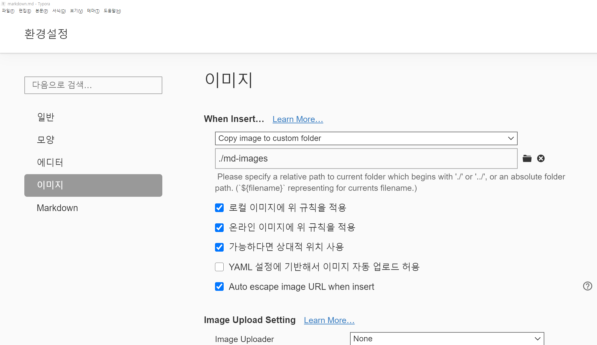

# 마크다운 문법

## 제목(heading)

제목은 `₩`으로 표현한다. 제목의 레벨은 `#`의 갯수로 표현되며, h1~h6까지 표현 가능하다.

## 목록

목록은 순서가 있는 목록과 순서가 없는 목록으로 구분된다.

1. 순서가 있는 목록

2. 순서가 있는 목록

   1. tab을 통해서 하위 레벨로 진입
   2. 계속 작성

   enter

3. enter

* 순서가 없는 목록

* 순서가 없는 목록

  * tab
  * 계속

  enter

* enter


## 코드 블록
```html            
<h1>
  html code
</h1>
```

```sq
select * from users;
```

```bash
$ git init
```


## 링크

[구글링크](www.google.com)

## 이미지


- 이미지를 상대경로로 저장하기 위해서 typora에 다음과 같은 설정을 한다.



## 표

| 순번 | 이름   | 비고 |
| ---- | ------ | ---- |
| 1    | 홍길동 |      |
| 2    | 김철수 |      |
| 3    |        |      |


## 기타

**굵게**

*기울임*

~~취소선~~

---

## 인용문

> 인용문입니다.


